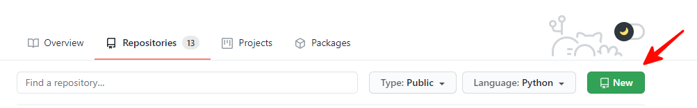
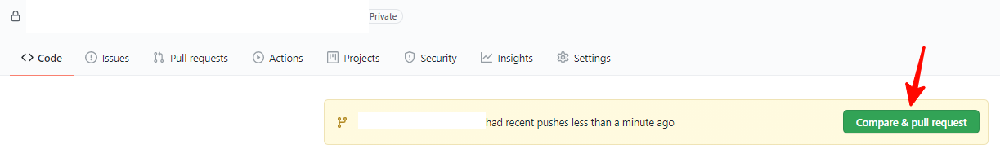
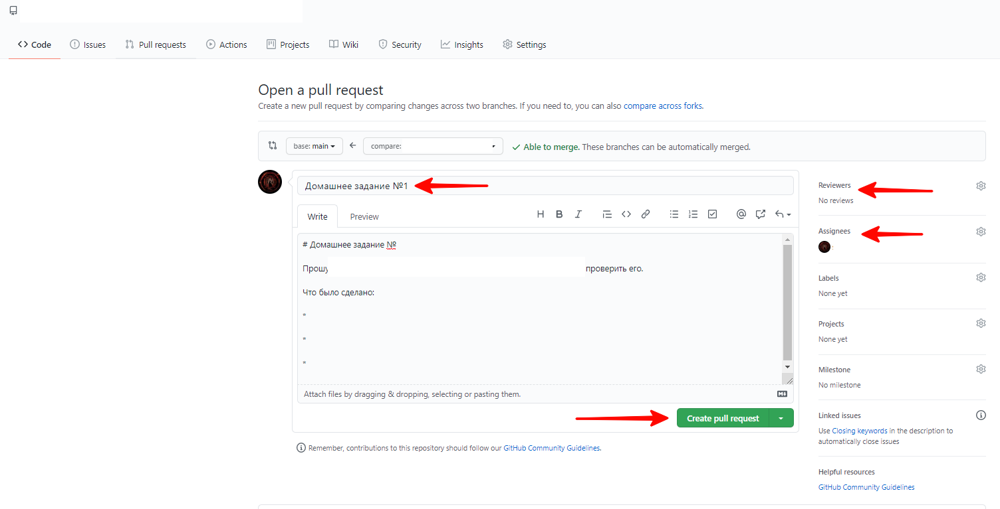
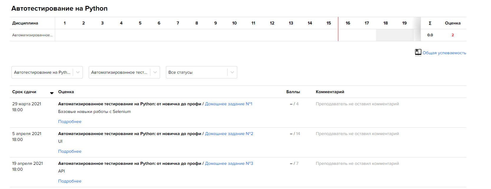

# Домашние задания курса "Автоматизированное тестирование"

### Инструкция по рабочему процессу с ДЗ

### 1. Присоединяемся к классу
* Создаем новую учетную запись на [GitHub](https://github.com) ЕСЛИ у вас ее нет.
* Переходим по [ссылке](https://classroom.github.com/a/IpojCXVx) и присоединяемся к классу.

* **ПОЖАЛУЙСТА** (!) выбирайте именно ваше ФИО из списка. Если его там точно нет - пишите в личку Михаилу Волкову. Не пытайтесь занять чьи-то имена, этот механизм исключительно для визуального отображения для преподавателей.
* Ссылку на ваш GitHub-аккаунт и учетную запись в Telegram добавляете в список соц.сетей на [портале education.vk.company](https://education.vk.company/cabinet/settings/additional_info/). Если вы этого не сделаете - к вам придут в ЛС и попросят это сделать.


### 2. Использование репозитория
* После выполнения п.1 будет автоматически создан новый репозиторий на GitHub. Он не будет вашим личным, 
а будет храниться в [репозиториях организации](https://github.com/orgs/VK-Education-QA-Python/repositories), впоследствии мы можете форкнуть этот репозиторий к себе на аккаунт и предоставлять его в резюме, если захотите.
* Репозиторий создается в формате: `2022-2-VK-QA-PYTHON-login`, где login - это ваш github login. Например, `2022-2-VK-QA-PYTHON-Starborn933`.
* Репозиторий автоматически создается типа Private. В репозитории все преподаватели/ассистенты являются администраторами.
* Репозиторий клонируется вами на вашу локальную машину любым удобным способом, а затем вы его можете добавить в IDE. 
PyCharm умеет скачивать репозитории сам (Get From VCS), если авторизоваться через гитхаб. Если испытываете проблемы с клонированием при использовании PyCharm - попробуйте создать отдельный GitHub токен и использовать авторизацию через токен.

### 3. Содержимое репозитория
Файлы в репозиторий из п.2 добавляются автоматически из шаблона, который был нами подготовлен. В нем есть все необходимые файлы для начала работы.
* Файл с именем `pull_request_template.md` в папке .github - это шаблон для ваших `PR (Pull Request)`, в котором есть упоминания всех преподавателей (для получения уведомлений). Сам файл при сдаче ДЗ редактировать **запрещено**. 
* Также папка `.github` - содержит в себе скрипты для [GitHub Actions](https://github.com/features/actions). 
Этот механизм позволит вам видеть ошибки, которые возникают при запуске домашки не на локальной машине (напомню, что домашки должны запускаться не только у вас). Некоторые домашки будут запускаться только при открытии PR, некоторые - на каждый push в репозиторий, по возможности старайтесь пушить реже.
Более подробно про GitHub Actions будет описано на портале.
* Файл с именем **.gitignore** - он позволит автоматически не добавлять в репозиторий временные файлы, создаваемые IDE или pytest'ом в папке проекта.
В случае, если вы используете IDE, отличную от PyCharm, **вам необходимо самостоятельно** добавить все форматы создаваемых вашей IDE временных файлов, чтобы никаких лишних файлов при сдаче домашек не было.
* Вы можете добавить в корень репозитория файл README.md и добавить какое-то описание. 
* Для каждой домашней работы вам нужно будет обновлять файл с зависимостями Python - [requirements.txt](https://pip.pypa.io/en/stable/user_guide/), этот файл должен быть один не репозиторий.
* В корне репозитория впоследствии будут папки с вашими домашками по курсу, которые были добавлены в результате одобрения Pull Request преподавателем, о чем будет написано далее.

### 4. Правила сдачи ДЗ
* Для всех ДЗ используется один репозиторий.
* В одном Pull Request сдается только **одно** ДЗ.
* Каждое ДЗ делается в **отдельной ветке** и папке, чтобы избежать возможных конфликтов при мерже. **Пуш домашки в ветку main - автоматически 0 баллов.** Не уверены в своих действиях - пересмотрите вторую лекцию, либо почитайте еще про Git, потестите на стороннем репозитории.
* Брать готовые методы или что-то из лекций - это нормально, мы специально их даем, чтобы в домашках было проще и понятнее.
* В случае, если при создании PR происходит конфликт веток, вам необходимо самостоятельно закрыть Pull Request и решить конфликт. 
* Папка для каждого должно называться в формате `homeworkN`, где N - номер домашки. Например, `homework1`. **ЭТО КРАЙНЕ ВАЖНО и требуется для корректной работы GitHub Actions!**
* В папке из пункта выше должен лежать conftest и иные необходимые папки и файлы, без лишней вложенности. **Хорошо:** `homework3/conftest.py`, **плохо**: `homework3/code/conftest.py`.
* Каждая ветка, из которой делается PR, должна быть синхронизирована с `main`. Создание новых веток для домашек необходимо выполнять после полной синхронизации локального кода с кодом из репозитория в ветке main. Затем, от последнего коммита, нужно делать новую ветку. **После этого в ветку `main` вносить изменения запрещено.**
Процесс синхронизации с помощью команд Git может быть разным, ниже представлен пример списка команд для синхронизации ветки main:
  ```
  1. git checkout main -> этой командой вы производите переход с ветки для 
  домашки на ветку main
  2. git pull -> этой командой вы производите синхронизацию вашего локального
   и удаленного репозитория
  3. git checkout -b <Ваше название ветки> -> этой командой вы создаете новую ветку
  ```
 

### 5. Сдаем ДЗ на проверку
* Создаем новую ветку в формате
`homeworkN`, где:
`N` - номер домашнего задания. Например: homework3. **Это КРАЙНЕ ВАЖНО.**
* После выполнения домашнего задания, создаем Pull Request в ветку `main`.
  
* В теме **обязательно** пишем номер ДЗ, в описании опционально пишем то, что сделано. Поля assignee и reviewers не заполняем.
* Нажимаем на кнопку `Create pull request`. Создастся Pull Request.



* Также вы можете зайти на портал [education.vk.company](https://education.vk.company/), нажать на иконку своего профиля (в правом верхнем углу), после этого откроется личный кабинет. Чтобы увидеть задания, которые нужно сдать, нажмите на вкладку Успеваемость. У вас откроется список домашних заданий:



* Подробное описание заданий представлено в репозитории курса на [GitHub](https://github.com/VK-Education-QA-Python/education-vk-python-2022). На портале же вы можете видеть все задания, которые нужно будет выполнить и дедлайн по ним, максимальное количество баллов. Решения на проверку через портал отправлять не нужно.
* **Все обсуждение ваших домашек происходит внутри Pull Request**, обсуждение в чате на портале вести не нужно. Если у вас есть какие-то вопросы по формулировкам комментариев преподавателя или ассистента, вы можете написать об этом ему в личку в Telegram.

### 6. Ожидаем проверки и вносим правки
 * С момента создания пулл-реквеста в него **запрещается** (!) вносить изменения, пока его не проверит преподаватель или ассистент.
 Внесение изменений после создания пулл-реквеста и до момента комментирования преподавателем может уменьшить итоговую оценку.
 * Если все выполнено корректно - преподаватель апрувит PR и выполняется мерж.
 * Если есть недочеты - будут оставлены замечания, которые надо будет быстро исправить и запушить в текущий PR. Мы их увидим и пересоздавать PR не нужно.
 * **После исправления всех недочетов в PR необходимо оставить комментарий "Исправлено",** это нужно, чтобы мы знали, что работу можно проверять повторно.

___

### 7. Критерии оценки ДЗ
* Для того, чтобы успешно сдать домашнее задание - нужно вовремя создать PR (до дедлайна домашки). Срок сдачи каждого задания - 1 неделя с момента его выдачи на лекции **(если иное не указано на странице домашки)**. Например, если срок сдачи - неделя, а задание было выдано в среду на неделю, то дедлайн - до 23:59 среды следующей недели.
* Максимальной оценкой оценивается решение, которое было выполнено правильно с первого раза согласно критериям проверки.
* Если были допущены сильные недочеты, то баллы снижаются в зависимости от степени замечаний на усмотрение преподавателя
* Если Вы сдаете ДЗ после дедлайна, не сдаете вообще – ДЗ автоматически оценивается в 0 баллов и более не принимается. Исключения конечно же есть – это невозможность сдать ДЗ по строго уважительной причине, например болезни с предоставлением справки (в период короновируса это в целом довольно актуально) или вынужденном отъезде куда-либо.
* **Максимальное количество попыток сдачи ДЗ - 3 раза.** Однако, дополнять домашнее задание теми частями, которых не было в изначальном PR - нельзя,
  допустимы только исправления ошибок, которые указаны преподавателями или менторами.
* Если есть ошибки, то после первичной проверки у **вас есть 4 дня на внесение изменений**. После второй проверки - три дня, после этого работа проверяется как есть, если не было каких-то уважительных причин.
Сроки могут быть увеличены в зависимости от проверяющего, но ориентироваться нужно на эти, не оставляйте домашки висеть неделями - у нас нет возможности их проверять столько времени. Если после проверки вы не вносите изменения в заданные сроки, задание будет оценено "как есть".
* **Можно выполнять только часть задач, указанных в домашке.** В этом случае, итоговый балл будет ниже, но если все сделано согласно ТЗ - домашка будет принята.
* В случае, если вы по каким-то причинам добавляете свою домашку в ветку main без одобрения преподавателя, домашнее задание считается **автоматически проверенным Вами самостоятельно** и за него выставляется 0 баллов.
* Проверяться будет все, как степень выполнения ДЗ согласно ТЗ, так и кодовая база (то есть как вы реализовали ту или иную задачу). Поэтому стараемся избавляться от неэффективных и чрезмерно перегруженных конструкций, копипаст и т.д.
* Отдельно про git, этот момент тоже будет проверяться, а именно – наличие лишних файлов в ПР, кривая история (без использования rebase, например), неинформативные коммиты и т.д.
* Даже если вами набран необходимым минимум для получения сертификата за курс, обязательным условием его является сдача финального проекта хотя бы на минимальный балл.